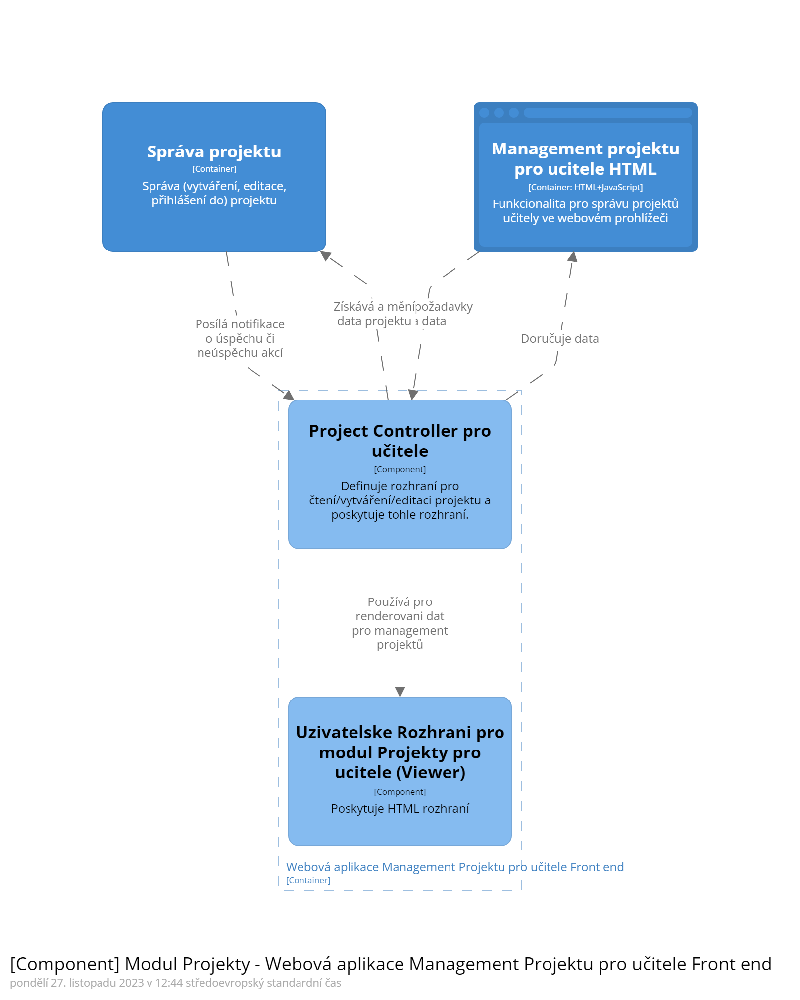
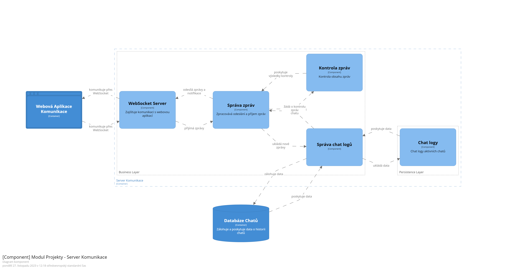
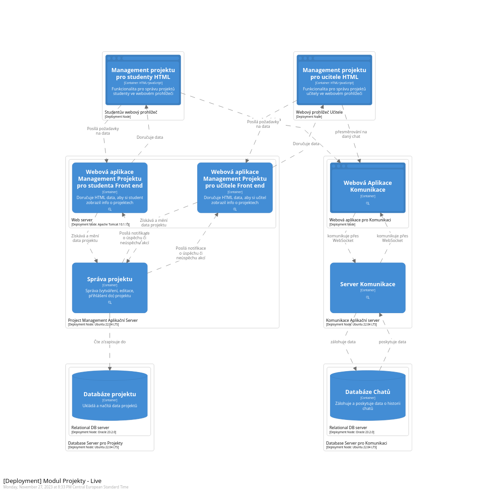

# Module Projects

This document describes the architecture of the `Projects` module. It is intended primarily for the `Student Information System` (`SIS` for short) development teams.

## Contents
- [Module Projects](#module-projects)
- [Contents](#contents)
- [Introduction](#introduction)
- [Core features](#core-features)
- [Containers and components](#containers-and-components)
  - [Teacher Web Application](#teacher-web-application)
  - [Student Web Application](#student-web-application)
  - [Communication Web Application](#communication-web-application)
    - [Chat notifications](#chat-notifications)
  - [Communication Server](#communication-server)
  - [Project Management](#project-management)
    - [System notifications](#system-notifications)
- [Deployment](#deployment)

## Introduction

`Projects` is the part of the `SIS` and is responsible for management of projects, enrolment of students in the project, communication within the project team and with the teacher.
The module allows:
1. Teachers to create new projets;
2. Students to sign up for projects;
3. Students to communicate inside the team.

The project module communicates with SIS system.

The described `Projects` context is displayed on the C4 model software system diagram.

*C4 diagram of the System Context: Projects*

## Core features

...

## Containers and components

`Projects` provides its functionality to the user through a web application. It is assumed that the user is logged into the `SIS` using their login credentials. There are two separate Web Applications for [Teacher](#teacher-web-application) and [Student](#student-web-application) due to the fact that the information displayed and the functionality provided are different for teachers and students.

There is also the [Communication Web Application](#communication-web-application) that provides access to the chat interface.

Data containing information about projects is persisted in the `Project Database`. Data containing chat information is persisted in the `Chat Database`.

*C4 diagram of the Module: Projects*

### Teacher Web Application

`Teacher` uses `Teacher Web Application` for announcement of project topics, confirmation of the project team, view project details including enrolled students and submitted files. After receiving a request from the `Teacher`, it retrieves the project data from the `Project Manager` and sends it to the `Teacher` via an HTML page.

*C4 diagram of the Teacher Web Application*

### Student Web Application

The student uses the `Student Web Application` to search and filter projects, enroll in required projects, upload and edit project files, view project details including other enrolled students, project supervisor, and submitted files. After receiving a request from the `Student`, it retrieves the project data from the `Project Manager` and sends it to the `Student` via an HTML page.

*C4 diagram of the Student Web Application*

### Communication Web Application

Accessible from the project page, the `Communication Web Application` allows either a `Teacher` or `Student` to initiate a chat by clicking the `View chat` button, which redirects to the chat web application. This application offers a feature for initiating private chats with specific members. It operates separately from the `Student` and `Teacher Web Applications`, necessitating only the member IDs and project ID to launch the appropriate chat window.

The simplicity of the redirect is achieved by the `Communication Web Application` having it's own `Chat Database`, which stores the chat logs and member information. The exact details of the redirect are implementation specific.

*C4 diagram of the Communication Web Application*

#### Chat notifications

The `Communication Web Application` displays notifications about new messages and members.

### Communication Server

Communication server provides business and persistent logic ... 

*C4 diagram of the Communication Application Server*

### Project Management

The core `Projects` logic that processes data received from a `Teacher` or `Student` through a `Web Application`. It provides business logic (which includes listing existing projects, editing, creating and signing up for projects), data checks and validations, query creation and communication with the `Project Database`.

*C4 diagram of the Project Management*

#### System notifications

The `Project Management` also includes a `Notification Manager` that sends a notification to the `Web Application` whether the action was successful or not.

## Deployment

Software system is deployed to four physical nodes: Application servers for Project Management, Application server for Communication and Database servers. The users are represented by their web browsers, where web applications send html pages, generated on the backend side.

Project management Application server is divided to two different parts: web application for user and container which provides business and persistent logic for Project management. Communication application server is roughly the same: web application for user on web server and business and persistent logic as one container. 

*C4 diagram of the Deployment*
