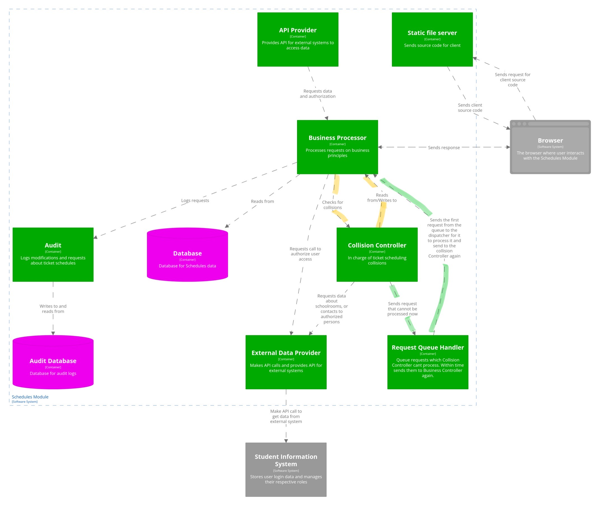

# Quality scenarios for the Schedules module

**Task:**

Describe 12 quality requirement scenarios for at least 6 quality dimensions.

- $>= 3$ quality requirements in design-time dimensions
  - [modifiability](#modifiability), [testability](#testability), [interoperability](#interoperability)
- $<= 9$ quality requirements in run-time dimensions
  - [performance](#performance), [availability](#availability), [scalability](#scalability), [security](#security)

For each scenario, decide if the architecture needs to be updated. Use the tactics from the lecture.

- If yes, update the C4 model and explain.
- If not, explain why the current architecture can fulfill the scenario.

**Template for a requirement:**

```markdown
### Scenario number

- Source of Stimulus:
- Stimulus:
- Artifact:
- Response:
- Measure:
- Architecture: OK / Needs update

Why is the architecture OK. / Note about architecture changes.
```

---

## Availability

### Scenario 1

- Source of Stimulus: Browser
- Stimulus: Inability to receive client source code from Static File Server
- Artifact: Static File Server
- Response: Mask the fault and repeat the request
- Measure: 1-second downtime
- Architecture: Needs update

The current architecture fails to respond if the Static File Server is unavailable. Implementing active redundancy and fault detection using HTTP HEAD requests will improve reliability.

Browser should send the request to the Request Handler, which will request data from the Static File Server and repeat the request if needed. It is also possible to provide backup copies of the static file server with active redundancy so the system can recover from a fault. If the Static File Server does not respond repeatedly, the Request Handler will redirect the request to one of the backup copies.

### Scenario 2

- Stimulus source: Business Processor
- Stimulus: Unable to get collision data response (Example: Ticket Editing, Automatic Scheduling Caller) after sending data to be checked
- Artifact: Collision Controller
- Response: Mask the fault, postpone, and log
- Measure: 5-minute retry interval
- Architecture: Needs update

A new container will be added for queueing requests. Within 5 minutes request will be sent to the Business processor again to be sent to the Collision Controller and serviced.

*C4 diagram*
### Scenario 3

- Source of Stimulus: Browser/User
- Stimulus: No response from the system
- Artifact: Business Processor
- Response: Mask the fault and repeat the request
- Measure: 5-second downtime
- Architecture: TODO

TODO

---

## Performance

### Scenario 1

   - Source of Stimulus: Business Processor (Automatic Scheduler Caller)
   - Stimulus: Automatic Scheduler Caller sends a request to Automatic Scheduler to schedule tickets and the results are not provided in a reasonable time. 
   - Artifact: Collision Controller (Automatic Scheduler)
   - Response: Try to avoid the situation by analyzing the task to estimate the time needed to schedule tickets. If the time is too long, the system can make a compromise by not fulfilling some of the teachers' preferences. If there is no preference fulfilled, but the estimated time is still too long, the system will notify the particular person about the situation.
   - Measure: The estimate corresponds approximately to the final time.
   - Architecture: Needs update
  
  The Architecture doesn't have to be changed with new components. To get the right list of contacts, the container needs to retrieve the data from the Student Information System.

---

## Security

### Scenario 1

   - Source of Stimulus: Unknown attacker
   - Stimulus: Request to view the schedule of a specific student
   - Artifact: Business Processor
   - Response: Unauthorized request detected
   - Measure: Each unauthorized request is detected, such requests are not processed.
   - Architecture: OK

In the current architecture, Business Processor is able to send API calls to authorize users, if authorization fails, the request will not be processed.

### Scenario 2

   - Source of Stimulus: Known attacker
   - Stimulus: Editing ticket data
   - Artifact: Business Processor
   - Response: Data are edited.
   - Measure: Data are edited and contain a stamp with the identity of the editor.
   - Architecture: OK
In the current architecture, the Business Processor is able to add information about the editor.

### Scenario 3
   -	Source of Stimulus: Known attacker
   -	Stimulus: Request to view the schedule of every schoolroom in a small amount of time
   -	Artifact: Business Processor
   -	Response: Request is detected before the attacker views every schedule.
   -	Measure: Each request is detected, after 5 viewed schedules requests for schedule viewing are not processed.
   -	Architecture: Needs update
A new component will be added for counting viewed schedules in a row.


---

## Scalability

### Scenario 1

   - Source of Stimulus: Browser/User
   - Stimulus: Increasing average number of requests
   - Artifact: Business Processor
   - Response: Request processing is scaled up
   - Measure: Performance and availability are not affected
   - Architecture: Needs update

To scale up the Business Processor, we would need a new container - router, to divide requests between multiple instances of the Business Processor by grouping similar requests.


  
### Scenario 2

   -	Source of Stimulus: Browser/User
   -	Stimulus: Higher number of tickets to schedule.
   -	Artifact: Collision Controller
   -	Response: Automatic Scheduler is scaled up.
   -	Measure: Performance and availability are not affected 
   -	Architecture: Need update
To scale up Automatic Scheduler, we would need a new container - router, to be able to divide requests between multiple instances of Automatic Scheduler by grouping similar requests.

---

## Modifiability

---

## Testability

### Scenario 1

   - System tester (stimulus source)
   - Stimulus: Testing Business Processor (dispatcher in particular) with requests
   - Artifact: Business Processor (Dispatcher)
   - Response: Synthetic user data is prepared, the correctness of requests dispatching is checked on the data
   - Measure: Coverage of 100% known user requests with different rights and permissions in 3 man-months

### Scenario 2
   - Source of Stimulus: System tester
   - Stimulus: Testing Collision Controller with tickets to check for collisions
   - Artifact: Collision Controller (Collision Checker)
   - Response: Synthetic tickets prepared and checked for collisions
   - Measure: Coverage of 100% known kinds of collisions in 2 man-weeks

---

## Interoperability

### Scenario 1

- Source of Stimulus: Enrollments module
- Stimulus: Display scheduled tickets (interoperability on data)
- Artifact: Schedules module
- Response: 100% of already scheduled tickets are provided
- Architecture: The architecture lacks a communication channel with the Enrollments module. The Dispatcher for the communication with external services should be added

### Scenario 2

   - Source of Stimulus: Collision Controller (Automatic Scheduler Caller)
   - Stimulus: Stimulus Source needs data about schoolrooms, buildings, and mutual distances from the Student Information System to schedule tickets.
   - Artifact: External Data Provider (External Data Provider Entry)
   - Response: Data about schoolrooms, buildings, and distances between them are provided.
   - Measure: 100% of required data are provided
   - Architecture: OK / Needs update
  
  The architecture lacks a communication channel between the Collision Controller and the Student Information System. A new container should be added for retrieving data from external services (External Data Provider).
